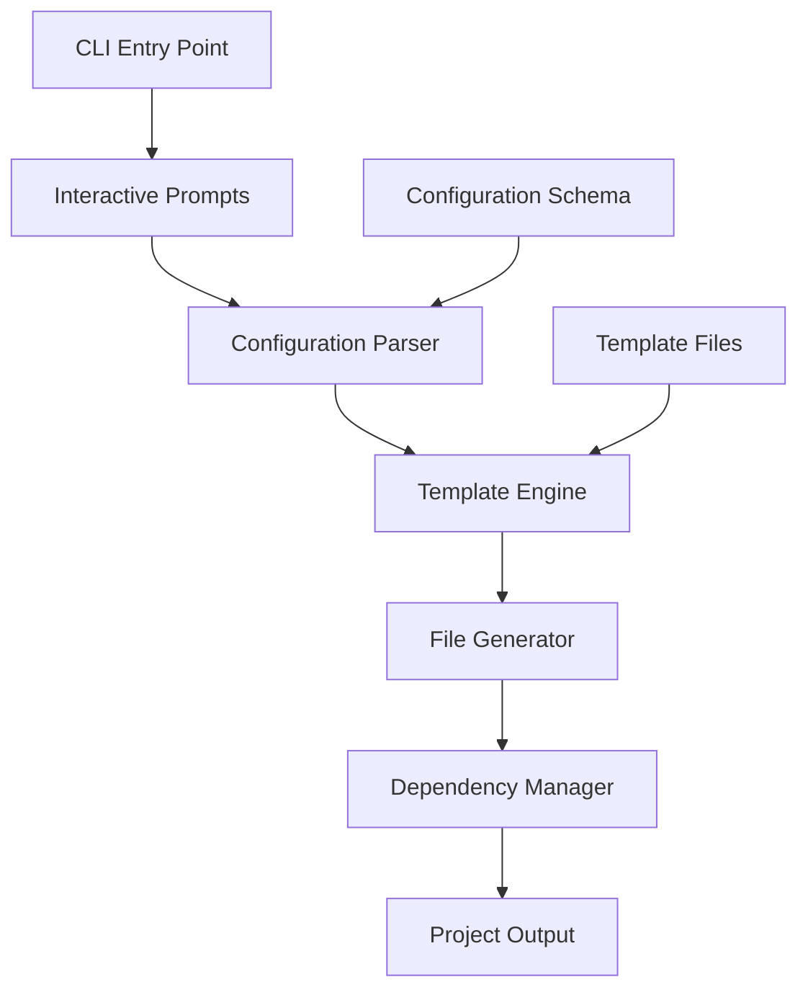

# Design Document

## Overview

The Vue Template Generator is a Node.js-based CLI tool that creates customized Vue 3 project templates. The tool follows a modular architecture with clear separation between user interaction, template generation, and file system operations. It leverages inquirer for interactive prompts and uses a template-based approach for generating project files.

## Architecture

### High-Level Architecture



### Core Components

1. **CLI Interface**: Handles command-line arguments and entry point
2. **Interactive Prompt System**: Manages user input collection using inquirer
3. **Configuration Manager**: Processes and validates user selections
4. **Template Engine**: Handles template file processing and variable substitution
5. **File System Manager**: Creates directories and files
6. **Dependency Manager**: Handles npm package installation
7. **Project Validator**: Ensures generated project integrity

## Components and Interfaces

### CLI Interface (`src/cli.ts`)
```typescript
interface CLIOptions {
  projectName?: string;
  template?: string;
  skipPrompts?: boolean;
  help?: boolean;
  version?: boolean;
}

class CLI {
  async run(args: string[]): Promise<void>
  private parseArguments(args: string[]): CLIOptions
  private showHelp(): void
  private showVersion(): void
}
```

### Interactive Prompt System (`src/prompts.ts`)
```typescript
interface ProjectConfiguration {
  projectName: string;
  cssPreprocessor: 'scss' | 'less';
  usePinia: boolean;
  useRouter: boolean;
}

class PromptManager {
  async collectConfiguration(): Promise<ProjectConfiguration>
  private validateProjectName(name: string): boolean | string
  private getFeaturePrompts(): InquirerPrompt[]
}
```

### Template Engine (`src/template.ts`)
```typescript
interface TemplateContext {
  projectName: string;
  features: string[];
  dependencies: Record<string, string>;
  devDependencies: Record<string, string>;
}

class TemplateEngine {
  async generateProject(config: ProjectConfiguration): Promise<void>
  private processTemplate(templatePath: string, context: TemplateContext): string
  private copyStaticFiles(sourcePath: string, targetPath: string): Promise<void>
  private generatePackageJson(context: TemplateContext): object
}
```

### File System Manager (`src/fileSystem.ts`)
```typescript
class FileSystemManager {
  async createDirectory(path: string): Promise<void>
  async writeFile(path: string, content: string): Promise<void>
  async copyFile(source: string, target: string): Promise<void>
  async directoryExists(path: string): Promise<boolean>
  validateProjectName(name: string): boolean
}
```

## Data Models

### Project Configuration Schema
```typescript
interface ProjectConfiguration {
  projectName: string;
  cssPreprocessor: 'scss' | 'less';
  usePinia: boolean;
  useRouter: boolean;
}

interface DependencyMap {
  core: Record<string, string>;
  scss?: Record<string, string>;
  less?: Record<string, string>;
  router?: Record<string, string>;
  pinia?: Record<string, string>;
}
```

### Template Structure
```
templates/
├── base/                    # Core Vue 3 + Vite + Ant Design Vue + TypeScript
│   ├── src/
│   │   ├── components/
│   │   ├── assets/
│   │   ├── App.vue
│   │   └── main.ts
│   ├── public/
│   ├── package.json.template
│   ├── vite.config.ts.template
│   ├── tsconfig.json
│   └── index.html.template
├── scss/                    # SCSS configuration and files
├── less/                    # Less configuration and files
├── router/                  # Vue Router files
└── pinia/                   # Pinia state management files
```

## Error Handling

### Error Categories
1. **User Input Errors**: Invalid project names, conflicting options
2. **File System Errors**: Permission issues, disk space, existing directories
3. **Network Errors**: Package installation failures
4. **Template Errors**: Missing template files, invalid template syntax

### Error Handling Strategy
```typescript
class ErrorHandler {
  handleUserInputError(error: UserInputError): void
  handleFileSystemError(error: FileSystemError): void
  handleNetworkError(error: NetworkError): void
  handleTemplateError(error: TemplateError): void
  
  private logError(error: Error): void
  private showUserFriendlyMessage(error: Error): void
}
```

### Recovery Mechanisms
- Automatic retry for network operations
- Cleanup of partially created projects on failure
- Detailed error messages with suggested solutions
- Graceful degradation for optional features

## Testing Strategy

### Unit Testing
- **CLI Interface**: Test argument parsing and command routing
- **Prompt System**: Mock inquirer responses and validate configuration
- **Template Engine**: Test template processing with various configurations
- **File System Operations**: Mock file system and test directory/file creation
- **Dependency Management**: Mock npm operations and test package installation

### Integration Testing
- **End-to-End Project Generation**: Test complete workflow from prompts to runnable project
- **Template Validation**: Ensure generated projects compile and run successfully
- **Cross-Platform Testing**: Test on Windows, macOS, and Linux
- **Package Manager Testing**: Test with npm, yarn, and pnpm

### Test Structure
```
tests/
├── unit/
│   ├── cli.test.ts
│   ├── prompts.test.ts
│   ├── template.test.ts
│   └── fileSystem.test.ts
├── integration/
│   ├── project-generation.test.ts
│   └── template-validation.test.ts
└── fixtures/
    ├── mock-templates/
    └── expected-outputs/
```

### Testing Tools
- **Vitest**: Primary testing framework
- **@vitest/ui**: Test UI for development
- **Mock File System**: For testing file operations without actual I/O
- **Inquirer Testing**: Mock user inputs for prompt testing

## Implementation Considerations

### Performance Optimizations
- Lazy loading of template files
- Parallel file operations where possible
- Efficient dependency resolution
- Minimal memory footprint for large projects

### Security Considerations
- Input validation and sanitization
- Safe file path handling to prevent directory traversal
- Secure template processing to prevent code injection
- Validation of generated package.json content

### Extensibility
- Plugin system for additional templates
- Configuration file support for team defaults
- Custom template directory support
- Hook system for post-generation scripts

### Cross-Platform Compatibility
- Path handling using Node.js path module
- Line ending normalization
- Permission handling across different file systems
- Shell command compatibility